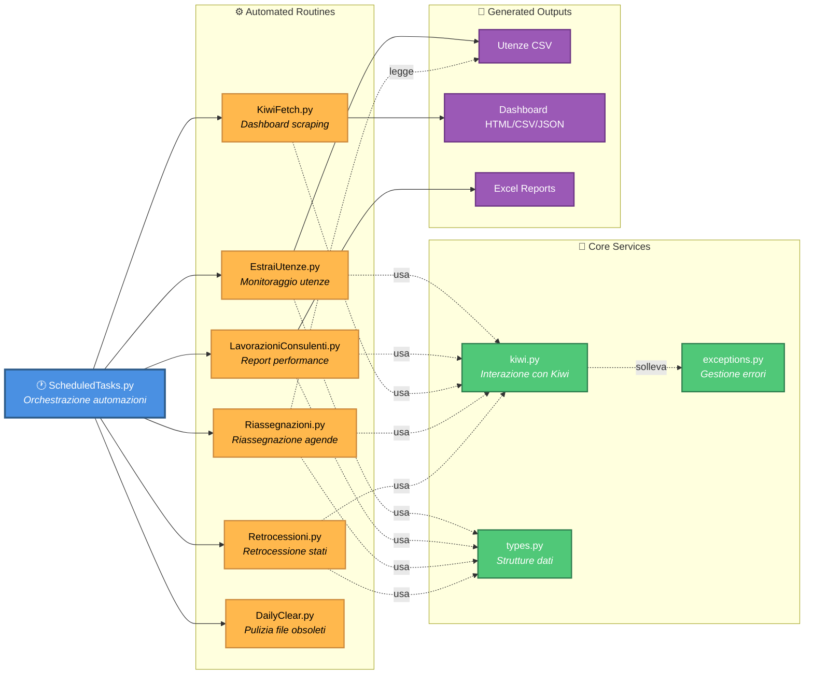
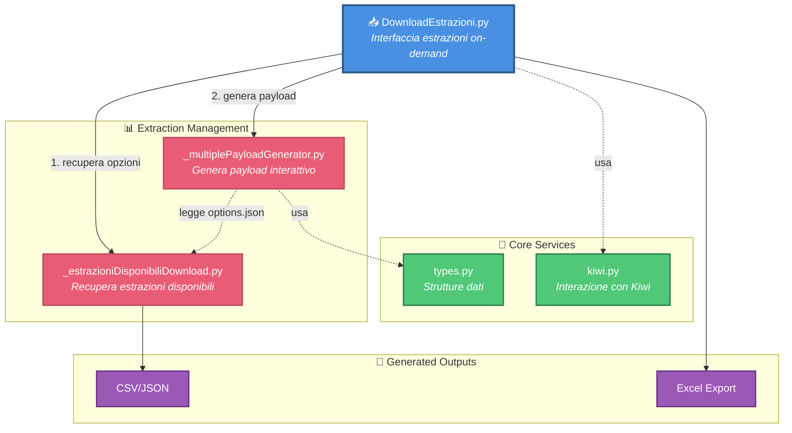

# Architettura

## 1️⃣ Runtime Architecture

---

## 2️⃣ Extraction Workflow

---

## 🧪 Modalità TEST

> Quando attivata tramite flag `--test`:
>
> * `kiwi.py` non effettua connessioni reali
> * vengono utilizzati snapshot HTML locali
> * tutte le routine operano offline
> * utile per sviluppo e debugging

---

## 📖 Legenda

| Elemento         | Significato                                            |
| ---------------- | ------------------------------------------------------ |
| 🔵 **Azzurro**   | **Entry Points** - Punti di ingresso dell'applicazione |
| 🟢 **Verde**     | **Core Services** - Moduli fondamentali condivisi      |
| 🟠 **Arancione** | **Automated Routines** - Automazioni schedulabili      |
| 🔴 **Rosa**      | **Extraction Management** - Gestione estrazioni dati   |
| 🟣 **Viola**     | **Generated Outputs** - File generati dal sistema      |
| ───              | **Linea solida** - Flusso principale                   |
| ╌╌╌              | **Linea tratteggiata** - Dipendenza / utilizzo         |

---

## 🔑 Note Architetturali

* `kiwi.py` rappresenta il cuore del sistema: tutte le routine che interagiscono con il gestionale passano attraverso questo modulo
* `ScheduledTasks.py` orchestra l'esecuzione sequenziale delle routine automatiche
* `DownloadEstrazioni.py` fornisce un'interfaccia guidata per estrazioni personalizzate
* `Riassegnazioni.py` legge istruzioni operative da file CSV compilati manualmente
* La modalità `__TEST__` consente di eseguire l'intero sistema offline utilizzando snapshot locali
